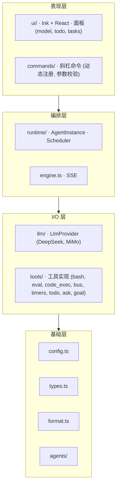

# 平台架构

## 层次结构

## AgentInstance

异步生成器，TUI 消费 `AgentEvent`。支持 pause / resume / terminate。完成时 resolve `completionPromise`（供 `join_agent`
使用）。

## 多 Provider

`LlmProvider` 接口。根据环境变量自动启用，根据模型名路由请求和余额查询。

## 工具系统

`tools/mod.ts` 统一注册。`eval` 工具通过 `yield*` 效应委托在进程内调用平台 API（沙箱：`node:vm`，效应标记：`Symbol`）。

## 上下文装配

缓存优先顺序：`model → stream → tools → messages`。goal / todo 在消息末尾注入（~180 tokens 合计）。

## 命令与面板

命令通过 `registerCommand(def)` 动态注册，声明 `panel` 时 UI 自动渲染对应面板。参数通过 `CommandDef.params` 校验。

## 状态栏符号

| 符号  | 含义               |
| ----- | ------------------ |
| `◧`   | 上下文用量         |
| `↑ ↓` | 累计输入/输出      |
| `⊕`   | 缓存命中率         |
| `⚒`   | 工具调用           |
| `⚙`   | 后台任务           |
| `◷`   | 睡眠               |
| `⏸`   | 暂停               |
| `¥/$` | 费用（按模型定价） |
